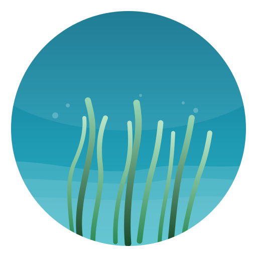
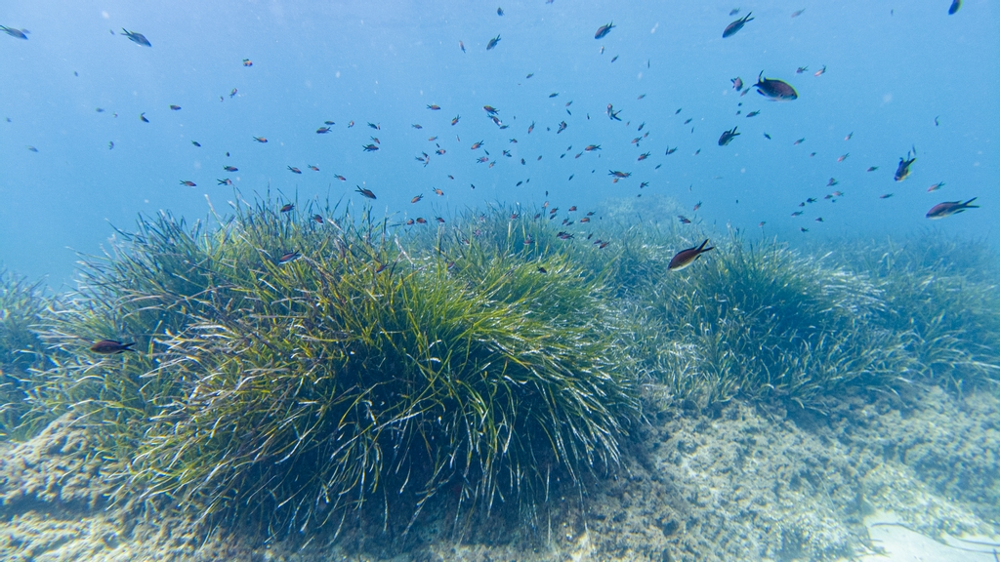
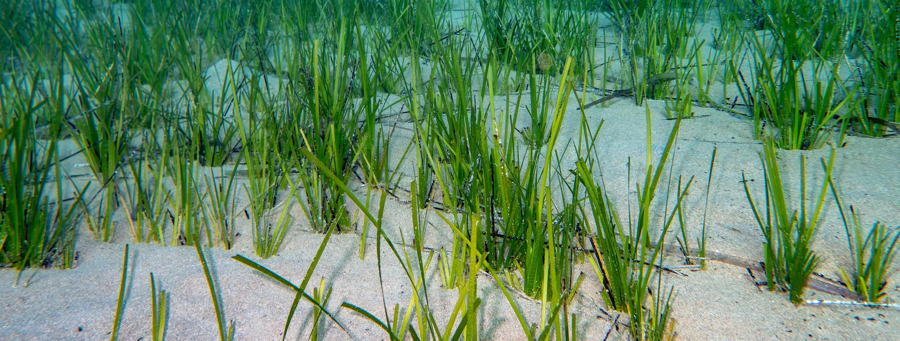
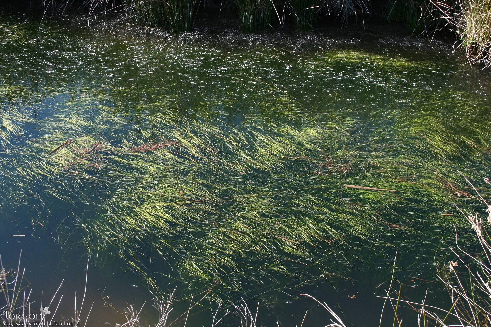
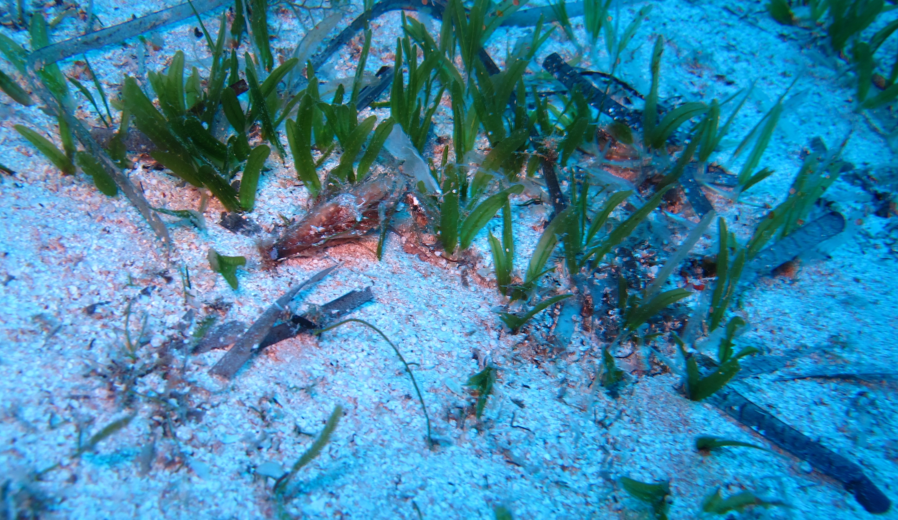
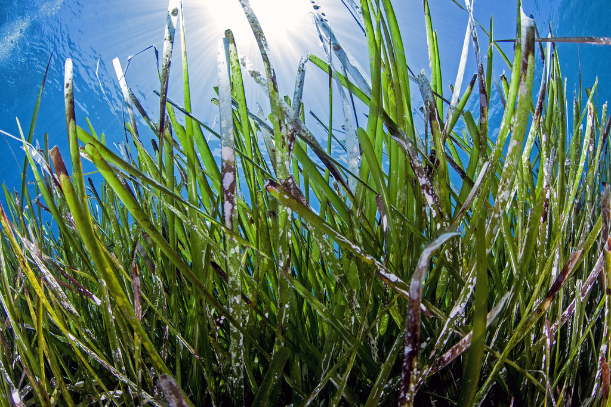

<div align="center">

    

    <h1>Mediterranean Seagrass Intelligence Panel 🌊🌿</h1>
    <p>A modern Streamlit dashboard to explore, analyze, and explain Mediterranean seagrass distribution using machine learning.</p>

    <a href="https://medseagrassdet.streamlit.app/"></a>
    
    
    
    

    <br/>
    <sub>Based on <em>Effrosynidis et&nbsp;al. (2018), Ecological Informatics</em></sub>
</div>

---


- [Overview](#-overview)
- [Live Demo](#-live-demo)
- [Key Findings](#-key-findings)
- [Quick Start](#-quick-start)
- [Project Structure](#-project-structure)
- [Tech Stack](#-tech-stack)
- [Credits & Citation](#-credits--citation)
---

## ✨ Overview
This intelligence panel delivers an end‑to‑end, reproducible analysis of Mediterranean seagrass presence using 217 environmental predictors across 3,055 samples. It includes interactive model comparisons, spatial validation, feature importance interpretation, and clear, actionable conclusions for conservation.


---
## 🌟 Highlights

- Project context, objectives, and species gallery (5 Mediterranean seagrass families)
- Dataset overview with distribution visualizations
### 📊 Variables & Statistics
- 217 predictors (static + temporal) with descriptive stats and correlations
- Geographic distribution and presence/absence splits

### 🎯 Binary Classification
- Compare algorithms across metrics (Accuracy, Precision, Recall, F1, ROC–AUC)
- Stratified vs Spatial cross‑validation to counter spatial autocorrelation
- Feature importance and ecological interpretation

### 🔢 Multi‑Class Classification
- Family‑level discrimination with imbalance awareness
- Spatial robustness assessment
- Top discriminative features and ecological signals

### 📝 Conclusions & Next Steps
- Key results, ecological insights, and deployment recommendations
- Future work: model generalization, data enrichment, neural networks

---

## 🚀 Live Demo

Open the hosted app:

👉 https://medseagrassdet.streamlit.app/

---

## 🧩 Features at a Glance

<div align="center">

<table>
    <tr>
        <td><b>Interactive EDA</b><br/><sub>Distributions • Correlations • Maps</sub></td>
        <td><b>Model Leaderboard</b><br/><sub>Compare algorithms across 5 metrics</sub></td>
        <td><b>Spatial Validation</b><br/><sub>GroupKFold by zone to reduce bias</sub></td>
    </tr>
    <tr>
        <td><b>Feature Importance</b><br/><sub>Explainability for each task</sub></td>
        <td><b>Downloads</b><br/><sub>Export tables as CSV</sub></td>
        <td><b>Responsive UI</b><br/><sub>Readable typography and styling</sub></td>
    </tr>
</table>

</div>

---

## 📈 Key Findings

- Binary (presence/absence)
    - Stratified CV: **98.8%** accuracy, ROC–AUC **99.9%**
    - Spatial CV: **88.0%** accuracy, ROC–AUC **95.6%**
- Multi‑Class (family level)
    - Stratified CV: **86.1%** accuracy
    - Spatial CV: **68.1%** accuracy
- Ecological driver signals
    - Binary: Distance to coast (geographic constraint) + strong Chlorophyll‑α seasonality
    - Multi‑class: Water clarity (Secchi depth, ZSD) dominates the top features
- Methodological insight: Spatial CV yields more realistic estimates than stratified CV (5–10 p.p. gap)

> Takeaway: Environmental clarity and proximity to shore shape both presence and family‑level patterns. Spatial validation is essential for real‑world deployment.

---

## 📊 Stratified vs Spatial — Side‑by‑Side

| Task | Cross‑Validation | Accuracy | ROC–AUC |
|------|------------------|---------:|--------:|
| Binary (presence/absence) | Stratified | 98.8% | 99.9% |
| Binary (presence/absence) | Spatial    | 88.0% | 95.6% |
| Multi‑Class (family)      | Stratified | 86.1% | — |
| Multi‑Class (family)      | Spatial    | 68.1% | — |

<sub>Spatial CV uses geographic zones (GroupKFold) to better reflect out‑of‑region generalization.</sub>

---

## 🧪 How It Works

```mermaid
flowchart LR
        A[Preprocessed Dataset\n(pres_abs_merge_def.csv)] --> B[Exploration & Stats\nVariables, Correlations, Maps]
        B --> C[Binary Models\nRF, KNN, DT, SVM, ...]
        B --> D[Multi-Class Models\nFamily-level]
        C --> E[Stratified CV]
        C --> F[Spatial CV\n(GroupKFold by Zone)]
        D --> E
        D --> F
        E & F --> G[Performance & Feature Importance]
        G --> H[Conclusions\nInsights • Recommendations]
```

---

## ⚙️ Quick Start

> Windows (PowerShell):

```pwsh
# 1) Clone and enter the panel folder
git clone https://github.com/guillemlcg/med_seagrass.git
cd med_seagrass/panel

# 2) Create & activate a virtual environment
python -m venv .venv
.\.venv\Scripts\Activate.ps1

# 3) Install dependencies
pip install -r requirements.txt

# 4) Run the app
streamlit run app.py
```

The app will open at http://localhost:8501

> Note: Dataset is expected at `../data/pres_abs_merge_def.csv` relative to this folder.

---

## 🗂️ Project Structure

```
panel/
├─ app.py                       # Main Streamlit app (routing, sidebar, styles)
├─ requirements.txt             # Dependencies
├─ README.md                    # You are here
├─ page_modules/                # Each page as a module
│  ├─ presentation.py
│  ├─ variables.py
│  ├─ binary_classification.py
│  ├─ multiclass_classification.py
│  └─ conclusions.py
└─ ../img/                      # Shared images (one level up)
     ├─ logo_seagrass_circle.svg
     ├─ menu_background.jpg
     └─ logos_footnote.png
```

---

## 📦 Data Sources

- Preprocessed dataset: `../data/pres_abs_merge_def.csv`
- Original raw data (Mendeley): https://data.mendeley.com/datasets/8nmh5grxp8/1
- Reference methodology:
    - Effrosynidis, D., Arampatzis, A., & Sylaios, G. (2018). *Seagrass detection in the Mediterranean: A supervised learning approach.* Ecological Informatics, 48, 158–175.

---

## 🧰 Tech Stack

<p>
     
     
     
     
     
</p>

---

## 🏷️ Credits & Citation

- Original Research: Effrosynidis et al. (2018)
- Data: CMEMS (Copernicus Marine Environment Monitoring Service)
- Development: Mediterranean Seagrass Project

If you use this work, please cite the paper and link to the app:

```
Effrosynidis, D., Arampatzis, A., & Sylaios, G. (2018). Seagrass detection in the Mediterranean: A supervised learning approach. Ecological Informatics, 48, 158–175.
```

---

## 🖼️ Gallery

<div align="center">
    <table>
        <tr>
            <td><br/><sub>Posidonia</sub></td>
            <td><br/><sub>Zostera</sub></td>
            <td><br/><sub>Cymodocea</sub></td>
        </tr>
        <tr>
            <td><br/><sub>Ruppia</sub></td>
            <td><br/><sub>Halophila</sub></td>
            <td><br/><sub>Seagrass habitat</sub></td>
        </tr>
    </table>
</div>

---

<div align="center">
    
  
    <br/>
    <sub><em>Built for Mediterranean seagrass conservation</em> 💙🌿</sub>
</div>
